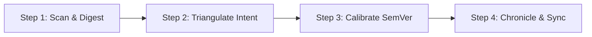

# Changelog Curator (Architectural Milestone Synthesis)

An AI agent skill for transforming raw Git commit histories, code diffs, and project requirements into **high-signal architectural changelogs**, **semantic milestone chronicles**, and **structured release notes**.

---

## 1. Core Philosophy: Why Not Raw Git Logs?

Automated CLI tools (`conventional-changelog`, `semantic-release`, `git-cliff`) merely regex-match commit one-liners into raw bullet lists. If commits are brief (e.g. `fix: header padding`, `fix: menu click`), the resulting changelog is noisy, fragmented, and devoid of architectural context.

**Changelog Curator enforces Architectural Synthesis:**
1. **Triangulate Truth:** Combine commit messages with actual file diffs (`git diff`), project specifications (`PRD.md`), and technical design notes (`docs/`).
2. **Cluster by Functional Capability:** Collapse dozens of incremental fix commits into overarching milestone themes rather than chronological noise.
3. **Visualize Lineage:** Maintain an ASCII/Unicode **Semantic Progression Matrix** illustrating version branches, minor feature lines, and patch tracks.
4. **Ergonomic Precision:** Explain *why* a change was made and what technical guarantees it provides (e.g. performance metrics, UX responsiveness, API contracts, security hardening).

---

## 2. The 4-Step Milestone Curation Workflow

Follow this procedure whenever preparing a new release, updating `CHANGELOG.md`, or documenting sprint deliverables:



### Step 1: Scan & Digest
Inspect the revision delta since the previous release or milestone:
```bash
# 1. Identify previous tag or base commit
git tag --sort=-creatordate | head -n 5

# 2. Extract commit range with dates and subjects
git log <last-tag>..HEAD --format="%h | %ad | %s" --date=short

# 3. Inspect high-impact file modifications and stat breakdown
git diff --stat <last-tag>..HEAD
```

### Step 2: Triangulate Intent
Do not rely on commit titles alone. Inspect the actual changes:
- Read active requirements or design specifications (`PRD.md`, `README.md`, `docs/technotes/`).
- Inspect modified function signatures, database schema migrations, and UI components.
- Identify whether breaking changes, deprecations, or security hardening occurred.

### Step 3: Calibrate SemVer Impact
Determine the highest semantic level represented in the changeset:
- **Major (`m.0.0`)**: Breaking public API changes, backward-incompatible schema migrations, or fundamental architecture transitions.
  > [!CAUTION]
  > Automatic incrementing of the Major version (`m`) is strictly prohibited. The system MUST explicitly advise the project owner/user and await written confirmation before bumping `m`.
- **Minor (`m.n.0`)**: New backward-compatible features, major UI redesigns, or new subsystem adapters.
- **Patch (`m.n.p`)**: Resilient bug fixes, visual alignment corrections, race-condition fixes, or performance optimizations.
- **Build / Docs**: Internal refactoring, test additions, or documentation adjustments without runtime behavior change.

### Step 4: Chronicle, Tree Update & Sync
1. Insert the new milestone entry at the top of the **Milestone Change Log Details** in `CHANGELOG.md`.
2. Update the ASCII **Semantic Version Progression Matrix** to reflect the new release node.
3. Synchronize with the project's root `VERSION` file if version tracking is enabled.
4. Generate the corresponding GitHub Release or tag annotation.

---

## 3. The Semantic Progression Matrix (ASCII Tree)

Every curated changelog should feature a visual progression matrix at the beginning, providing instant visual comprehension of the software's lineage.

### Tree Syntax Standards
- Use Unicode box-drawing characters: `├─►`, `│`, `└─►`.
- Indent child patches or sub-milestones under their parent minor/major version.
- Annotate each node with its primary thematic achievement.

### Example Matrix
```text
v2.1.0 (Baseline Modern Architecture)
  │
  ├─► v2.2.0 (Feat: Noise Filter M < 2.0 & Mission-Control Telemetry Popup)
  │
  ├─► v2.10.0 (Feat: Full-Spectrum Day/Night Theme Sync & Corner Docking)
  │     │
  │     ├─► v2.10.1 (Fix: Concealed Admin Route /samet & Deceptive 404)
  │     │
  │     └─► v2.10.7 (Feat: Timeline Playback Sonification & Live Audio Alarm)
  │
  └─► v2.11.0 (Feat: 3-Column Observatory Header & Telemetry HUD Capsule)
        │
        └─► v2.11.1 (Fix: Resilient Corner Widget Clamping & Crisp Vector Icons)
```

---

## 4. Milestone Change Log Specification

Structure each milestone entry using the following rigid Markdown schema:

```markdown
### [v<Major>.<Minor>.<Patch>] — <YYYY-MM-DD>
**<Category>: <Concise Human-Readable Title>**
- **Type**: `<feat|fix|refactor|perf|security>` / `<optional-scope>` / `<milestone-level>`
- **Scope**: `<comma-separated list of affected components, files, or packages>`
- **Key Deliverables**:
  - **<Subsystem / Feature Focus>**: Detail the exact problem, solution, and technical mechanism. Mention specific algorithms, CSS classes, or API endpoints.
  - **<Ergonomics / UI / UX Focus>**: Detail the user experience, interaction smoothness, or visual hierarchy improvements.
  - **<Security / Reliability / Performance>**: Quantify improvements (e.g. latency, bundle size, edge cases clamped, memory leaks plugged).
```

---

## 5. Automated Release Notes Generation

When creating a GitHub, GitLab, or Git tag release, extract the latest milestone entry directly into the release body:

```bash
# Automated GitHub Release Creation using GitHub CLI
gh release create "v<VERSION>" \
  --title "v<VERSION> - <Milestone Title>" \
  --notes-file <(sed -n '/### \[v<VERSION>\]/,/---/p' CHANGELOG.md | sed '$d')
```

---

## 6. Multi-Platform Agent Support

This skill is designed for full cross-compatibility across modern AI coding agents:

| AI Agent | Integration Mechanism | Configuration File |
| :--- | :--- | :--- |
| **Claude Code** | Native Agent Skill | `~/.claude/skills/changelog-curator/SKILL.md` |
| **OpenAI Codex** | Assistant Skill & Prompt | `~/.codex/skills/changelog-curator/SKILL.md` |
| **Cursor** | Custom Project/Global Rule | `~/.cursor/rules/changelog-curator.mdc` or `.cursorrules` |
| **Inflection Pi** | Custom Instruction Set | `~/.pi/skills/changelog-curator/SKILL.md` |
| **Antigravity / Gemini CLI** | Native Customization Skill | `~/.gemini/config/skills/changelog-curator/SKILL.md` |

### Platform-Specific Behaviors:
- **Claude Code**: When invoked via `/release` or when asked to prepare a release, Claude should scan `git diff`, update `CHANGELOG.md`, and format release notes.
- **Cursor**: The `.mdc` rule attaches to any edits targeting `CHANGELOG.md` or release note files to enforce the taxonomy and tree structure.
- **Codex / OpenAI**: Enforces structural constraints via `agents/openai.yaml` to ensure concise, high-signal engineering summaries without marketing fluff.
- **Pi**: Focuses on clear narrative synthesis and explaining complex code updates in accessible, precise language.
